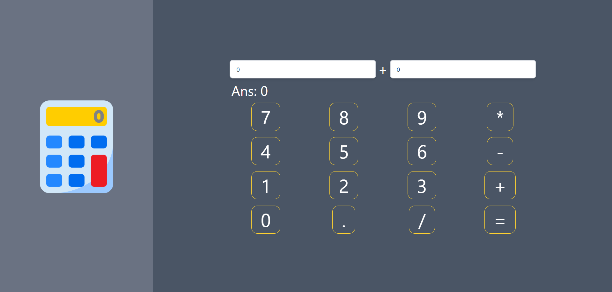

# Simple Calculator

A simple calculator web application built with React and styled using Tailwind CSS. The app features a clean two-column layout with a calculator image on the left and an interactive calculator interface on the right.

## Features

- Basic arithmetic operations: addition (+), subtraction (-), multiplication (*), and division (/).
- Two input fields for entering numbers.
- Dynamic calculation of results as inputs or operators change.
- Calculation can also be triggered by pressing the "=" button.
- Responsive and user-friendly UI with styled buttons and inputs.

## User Interface

- **LeftBar:** Displays a calculator image for visual appeal.
- **RightBar:** Contains the calculator interface with:
  - Two number input boxes.
  - Operator display.
  - Result display.
  - Buttons for digits, operators, decimal point, and equals.

## Technologies Used

- React
- Tailwind CSS
- Vite (for development and build)

## File Structure

```
src/
├── App.jsx           # Main app component with layout
├── main.jsx          # Entry point for React app
├── index.css         # Global styles
├── App.css           # App-specific styles
└── Components/
    ├── LeftBar.jsx   # Left side component with image
    ├── RightBar.jsx  # Calculator UI and logic
    ├── Button.jsx    # Reusable button component
    └── InputBox.jsx  # Reusable input component
public/
└── calculator.png    # Calculator image used in LeftBar
```

## Installation and Running

1. Clone the repository.
2. Install dependencies:

```bash
npm install
```

3. Start the development server:

```bash
npm run dev
```

4. Open your browser and navigate to the URL shown in the terminal (usually http://localhost:3000).

## Screenshot

The app displays a calculator image on the left and the interactive calculator on the right.


## License

This project is open source and free to use.
